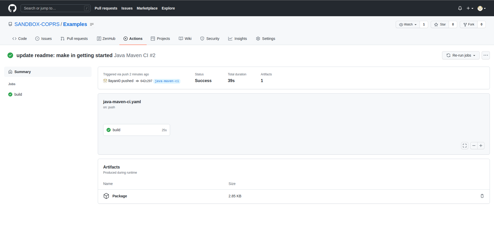

# Getting started using the GitHub CI 

## Create a repo 

Create a repo following [this tutorial](https://docs.github.com/en/get-started/quickstart/create-a-repo)

## Push your java maven project

Push your project on the repo. The project should look like [this one](https://github.com/mkyong/maven-examples/tree/master/maven-code-coverage)

## Enable the Gitub Action 

On the root of the repo, create a folder called `.github`. 
Inside this folder, create another folder called `workflows`

Inside the `workflows` folder, paste [this GitHub Action configuration](.github/workflows/java-maven-ci.yaml)
Then push your modifications  

To understand the configuration file, you can refer to the [official documentation](https://github.com/features/actions)

## Check the state of the CI on the Action tab  

Click on the [Action tab](https://github.com/SANDBOX-COPRS/Examples/actions) on the GitHub repository. 

The output should look like this:

Click on the first CI run. And then on Package. Github will propose you to download a file. 

That's the Jar that has been created.  

## Technical Points

Technicals explantations can be found on [this file](technical_points.md)

# Test GitGuardian 

username = avlkj#qlskdj#9?
password = slqkj{|#àD}
tititi
